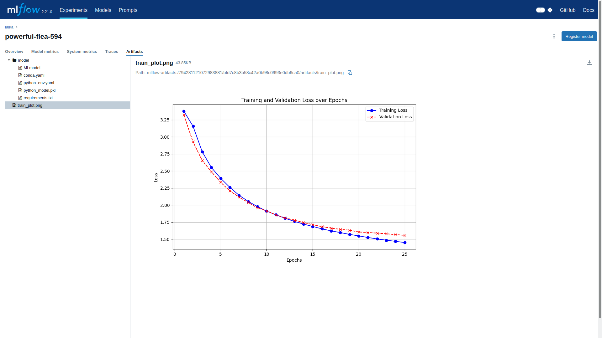

# NLP
Project for catching up with nlp methods.\
It consists of:
- parsing raw text for creation of custom datasets
- custom(but using torch autograd) implementation of some sequence oriented architectures(for now there are):
  - MLP
  - vanilla RNN
  - LSTM
  - GRU
- tracking training runs in mlflow
***
Example screen from mlflow:
